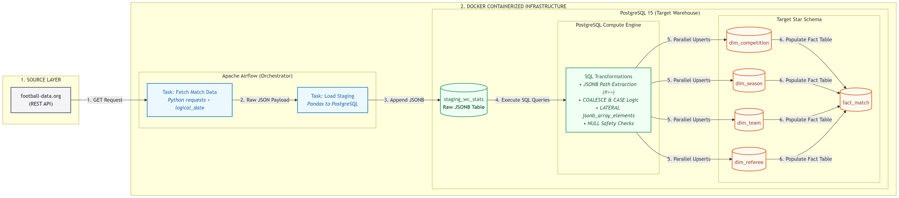

# 🏆 Automated World Cup Data Pipeline (ELT)

## 📌 Project Overview
This project is an automated ELT (Extract, Load, Transform) data pipeline built with Apache Airflow and PostgreSQL. It dynamically extracts football match statistics from the football-data.org REST API, stages the raw JSON payloads, and transforms the highly nested data into a robust Star Schema optimized for analytics and BI reporting.

## 🛠️ Tech Stack
1. Orchestration & Infrastructure: Apache Airflow, Docker Compose
2. Database / Data Warehouse: PostgreSQL
3. Programming Language - Python (Data Processing, API Interactions)
4. Scripting Language - SQL

## 🏗️ Architecture & Data Flow
The pipeline follows a modern ELT architecture, leveraging PostgreSQL's powerful native JSON compute capabilities for transformations rather than processing data in memory.

Extract: A Python-based Airflow task dynamically calls the API using Airflow's logical_date to ensure idempotency. It securely handles credentials via Airflow Variables and safely manages API limits.

Load (Staging): The raw JSON payload is loaded directly into a staging_wc_stats table using Pandas and SQLAlchemy.

Transform (Dimensional Modeling): Airflow executes a parallelized series of SQL Upsert operations (INSERT ... ON CONFLICT DO UPDATE). These queries utilize advanced PostgreSQL JSON operators (->>, #>>, jsonb_array_elements) to unpack nested dictionaries and arrays directly into relational Dimension and Fact tables.

## 🗄️ Data Model (Star Schema)
The transformed data is structured into a Star Schema to facilitate fast analytical querying.

fact_match: The core transactional table containing match times, stages, final scores (handling extra time and penalties via COALESCE), and calculated winner IDs.

dim_team: Contains team metadata. (Constructed by unioning nested homeTeam and awayTeam dictionaries from the fact records).

dim_referee: Explodes the JSON array of match officials into individual rows.

dim_competition & dim_season: Tracks tournament-level metadata.

## 🚀 Key Features & Best Practices Applied
Idempotency & Catchup: The DAG utilizes Airflow's context (logical_date) to fetch data relative to the execution run, allowing seamless historical backfilling without duplicate data.

Defensive Engineering: Incorporates NULL safety checks (IS NOT NULL) on all primary keys before insertion to prevent pipeline crashes from API anomalies.

Parallel Task Execution: Dimension tables (dim_team, dim_referee, etc.) are loaded concurrently in Airflow before the fact_match table, drastically reducing pipeline runtime.

Advanced JSON Parsing in SQL:

Uses LATERAL jsonb_array_elements to dynamically explode JSON arrays (like Referees) into relational rows.

Employs DISTINCT ON to safely handle multiple referees per match without causing Primary Key violations.

Upsert Logic: Uses PostgreSQL's ON CONFLICT (id) DO UPDATE SET to seamlessly update existing records (e.g., when a match status changes from "IN_PLAY" to "FINISHED") without dropping tables.

## 🐳 Docker Infrastructure & Local Environment
This project is fully containerized using Docker Compose, making it easy to deploy on any machine while mimicking a real-world enterprise setup:

Containerized Execution: The entire pipeline, from the orchestrator to the database, runs within Docker containers, eliminating complex local installations.

Production-Like Separation: To follow data engineering best practices, the Apache Airflow system (which runs the pipeline) and the PostgreSQL Data Warehouse (which stores the finalized data) are kept in completely separate, isolated containers.

Developer Friendly: The environment is configured with live code-syncing—meaning changes to your Python DAGs update instantly in the UI—and persistent storage, so your downloaded tournament data is never lost when the containers are shut down.

